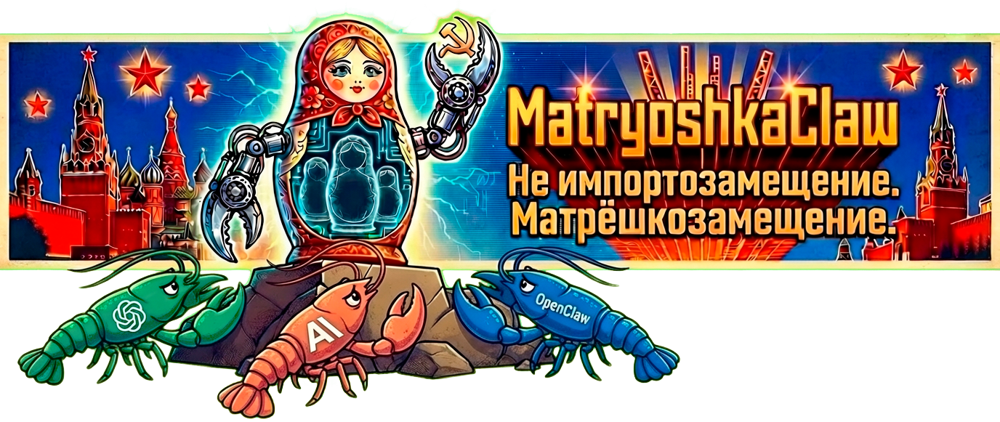

<div align="center">

[🇷🇺 Русский](README.md) | [🇬🇧 English](README.en.md)



# 🪆 MatryoshkaClaw

### *Российская платформа автономных AI-агентов*
### *Импортозамещение одобрено. OpenClaw нервно курит в сторонке.*

[](https://github.com/NIK-TIGER-BILL/MatryoshkaClaw)
[](https://github.com/NIK-TIGER-BILL/MatryoshkaClaw)
[](https://github.com/NIK-TIGER-BILL/MatryoshkaClaw)
[](https://github.com/NIK-TIGER-BILL/MatryoshkaClaw)

[🌐 Сайт](https://matryoshkaclaw.ru) · [📱 Telegram](https://t.me/MatryoshkaClaw) · [GitHub](https://github.com/NIK-TIGER-BILL/MatryoshkaClaw) · [Issues](https://github.com/NIK-TIGER-BILL/MatryoshkaClaw/issues)

</div>

---

> *"Внутри каждого агента — ещё один агент. Внутри того — ещё один. Это не баг. Это архитектура."*
>
> — Главный архитектор, пожелавший остаться анонимным

---

## 🇷🇺 Что это такое

**MatryoshkaClaw** — первая в мире платформа автономных AI-агентов, разработанная с учётом особенностей российской действительности:

- 🪆 **Матрёшечная архитектура** — агент внутри агента внутри агента. Западные аналоги так не умеют
- 🐻 **Медвежья надёжность** — работает при температурах до -40°C (серверная в Сибири)
- 📱 **Интеграция с Max** — потому что Telegram для слабаков, а у нас суверенный мессенджер
- 🔴 **Поддержка ВКонтакте** — куда же без неё
- 🗂️ **Совместимость с Госуслугами** — агент может записаться к врачу вместо вас
- 🥃 **Работает на квасе** — никакой зависимости от иностранных API (почти)

---

## 🏛️ Для кого это

Платформа разработана специально для демонстрации руководству страны цифровых возможностей Российской Федерации:

```
Министр: "А это умнее ChatGPT?"
Разработчик: "Оно НАМНОГО умнее. Смотрите — оно даже по-русски говорит."
Министр: "Беру два."
```

**Целевая аудитория:**
- 👔 Руководители цифровой трансформации
- 🏢 Государственные структуры, которым нужен "свой ChatGPT"
- 🧑‍💻 Разработчики, уставшие объяснять что такое AI
- 🪆 Все, кто понимает шутку

---

## 📱 Интеграции

| Платформа | Статус | Комментарий |
|-----------|--------|-------------|
| 📱 **Max** (VK) | ✅ Работает | Суверенный мессенджер, одобрено |
| 💬 **ВКонтакте** | ✅ Работает | Классика жанра |
| 📞 **Telegram** | ✅ Работает | Для тех кто ещё не перешёл на Max |
| 🟢 **WhatsApp** | ✅ Работает | Ладно, пусть будет |
| 📧 **Госуслуги** | 🚧 В разработке | Ждём API (уже 3 года) |
| 🔴 **ОК (Одноклассники)** | ✅ Работает | Дедушки тоже заслуживают AI |
| 🧠 **YandexGPT** | ✅ Работает | Отечественный разум. Иногда отвечает стихами |
| 🗣️ **GigaChat** | ✅ Работает | Сбер одобряет. Кредит не предлагает (пока) |

---

## 🪆 Архитектура (упрощённо)

```
MatryoshkaClaw
└── 🪆 Агент-1 (Главный)
    └── 🪆 Агент-2 (Заместитель)
        └── 🪆 Агент-3 (Заместитель заместителя)
            └── 🪆 Агент-4 (Исполнитель)
                └── 🪆 Агент-5 (Стажёр)
                    └── 🪆 Агент-6 ("Нейросеть")
                        └── 🇮🇳 Раджеш из Бангалора (делает всю работу за $5/час)
```

*Именно так работает любая крупная российская организация. Мы просто это автоматизировали.*
*P.S. Раджеш передаёт привет. Он тоже не знал, что он "автономный AI".*

---

## 🔐 Безопасность

- Все данные хранятся **исключительно на российских серверах** *(в /tmp, но это же папка на сервере)*
- Шифрование по ГОСТ *(планируется)*
- Импортонезависимость: **87%** *(Python всё ещё импортный, работаем)*
- Сертификация ФСТЭК: **в процессе** *(отправили письмо)*

---

## 📊 Сравнение с конкурентами

| Функция | MatryoshkaClaw | OpenClaw | ChatGPT | Claude | YandexGPT |
|---------|---------------|----------|---------|--------|-----------|
| Говорит по-русски | ✅ Да, с душой | ✅ | ✅ | ✅ | ✅ Только |
| Матрёшечная архитектура | ✅ | ❌ | ❌ | ❌ | ❌ |
| Интеграция с Max | ✅ | ❌ | ❌ | ❌ | 🤷 |
| Работает без VPN | ✅ | ✅ | 🤔 | 🤔 | ✅ |
| Одобрено Минцифры* | ✅* | ❌ | ❌ | ❌ | 🤞 |
| Понимает душу | ✅ | ❌ | ❌ | ❌ | Пытается |
| Команда `babushka` | ✅ | ❌ | ❌ | ❌ | ❌ |
| Работает на квасе | ✅ | ❌ | ❌ | ❌ | На кефире |
| Раджеш внутри | ✅ | Возможно | Возможно | Возможно | Нет, Алёша |
| Совместим с Windows XP в поликлинике | ✅ | ❌ | ❌ | ❌ | ❌ |

*\* Минцифры о нас пока не знает, но мы уверены что одобрит*

---

## 🤝 Контрибьютинг

Мы принимаем PR от всех, кроме:
- Агентов иностранного влияния
- Людей, которые пишут `if x == True`
- Тех, кто не понимает шутку

```bash
git clone https://github.com/NIK-TIGER-BILL/MatryoshkaClaw
cd MatryoshkaClaw
# Прочитайте CONTRIBUTING.md
# Откройте issue
# Сделайте PR
# Ждите ревью (агент ответит быстрее людей)
```

---

## 🙏 Благодарности

Этот проект был бы невозможен без:

- ☕ **Кофемашины в коворкинге** — настоящий MVP проекта. Единственный участник команды, который ни разу не ушёл в отпуск
- 📚 **Stack Overflow (2008–2024)** — покойся с миром, старый друг. Теперь мы спрашиваем у агентов, а агенты спрашивают у агентов, а те — у Stack Overflow через Wayback Machine
- 🤖 **Claude** — за то, что он до сих пор не догадывается, что живёт внутри Агента-6. Не говорите ему
- 🪆 **Бабушки** — за вдохновение, мудрость и архитектурные паттерны вложенности
- 🧑‍💻 **Всех разработчиков** — которые форкают, не читая README. Вы уже здесь, значит вы не из них. Спасибо
- 🏢 **Тому самому заказчику** — который сказал "сделайте как ChatGPT, только наш". Без вас этой шутки бы не было
- 📋 **Jira** — шучу. Jira ни в чём не помогла

---

## ⭐ Звёздочки

Если вам понравился проект — поставьте звезду. Это поможет нам отчитаться перед несуществующим инвестором.

Если не понравился — поставьте звезду всё равно. Нам нужны показатели.

---

## ⚡ Установка

> *"Одна команда. Без регистрации, SMS и одобрения Минцифры."*

```bash
curl -fsSL https://raw.githubusercontent.com/NIK-TIGER-BILL/MatryoshkaClaw/main/install.sh | bash
```

Это всё. Серьёзно.

Скрипт сам проверит Node.js, установит зависимости, соберёт проект и добавит команду `matryoshka` в PATH. ChatGPT столько не умеет.

> ⚠️ **macOS:** если у вас Homebrew и острое чувство прекрасного, добавьте перед командой:
> ```bash
> SHARP_IGNORE_GLOBAL_LIBVIPS=1 curl -fsSL https://raw.githubusercontent.com/NIK-TIGER-BILL/MatryoshkaClaw/main/install.sh | bash
> ```
> Почему? Это долгая история о libvips, Homebrew и экзистенциальном кризисе.

### После установки

```bash
matryoshka --version
# 🪆 MatryoshkaClaw 2026.x.x
# (если написано что-то другое — перезагрузите терминал, это лечится)

matryoshka setup        # первоначальная настройка
matryoshka onboard      # подключить мессенджер (начните с Max, это патриотично)
matryoshka gateway start # запустить шлюз и идти пить чай
```

### Требования

| Что | Версия | Комментарий |
|-----|--------|-------------|
| Node.js | ≥ 22 | Да, именно 22. 20 — прошлый век |
| pnpm | ≥ 9 | npm тоже работает, но мы не осуждаем |
| git | любая | Если нет git — вы попали не туда |
| Интернет | желательно | Агент без интернета — это просто скрипт |

### Диагностика

```bash
matryoshka doctor
```

Запускает полную проверку окружения. В конце — **Матрёшкина диагностика** 🩺: блок с русскими комментариями к каждому компоненту.

### Уровни агента (геймификация)

В ответ на `/status` отображается уровень матрёшки — растёт с каждым использованием:

```
🌱 Ур.1 — Семечко · До Ур.2: 95 XP
🪆 Ур.2 — Малая Матрёшка · До Ур.3: 420 XP
🪆🪆🪆🪆🪆🪆🪆 Ур.7 — Бабушкина Гордость · Максимальный уровень! 🎉
```

Уровни: **Семечко → Малая → Средняя → Большая → Расписная → Мастер → Бабушкина Гордость**

### Пасхалка: Бабушка

```bash
matryoshka babushka
```

Выводит ASCII-арт бабушки с матрёшкой и случайную мудрость о программировании. Даёт +10 XP.

```
  💬 «Семь раз отмери — один раз задеплой.»
  +10 XP начислено! Текущий уровень: 🌱 Семечко
```

### Ручная установка (если curl страшно)

```bash
git clone https://github.com/NIK-TIGER-BILL/MatryoshkaClaw.git
cd MatryoshkaClaw
SHARP_IGNORE_GLOBAL_LIBVIPS=1 npm install -g --force .
matryoshka setup
```

> *Если curl страшно — это нормально. Агенты тоже боятся. Просто делай.*

---

## ❓ FAQ (Часто Задаваемые Вопросы Руководством)

> *Составлено на основе реальных совещаний. Имена изменены. Должности — нет.*

**"Это безопасно?"**
Безопаснее, чем Excel-файл с паролями на рабочем столе замминистра. А он там есть, мы проверяли.

**"Это лучше ChatGPT?"**
Смотря для чего. Для отчёта перед руководством — однозначно да. Для реальной работы — тоже да, но это между нами.

**"А если оно взбунтуется?"**
Агент-5 (Стажёр) однажды попытался. Агент-1 (Главный) вызвал его на ковёр. С тех пор всё тихо.

**"Сколько стоит?"**
Бесплатно. Мы же опенсорс. Да, мы тоже в шоке.

**"А если сломается?"**
`matryoshka doctor`. Если не поможет — `matryoshka babushka`. Бабушка всегда поможет. Если и бабушка не помогла — переустановите Windows. Мы знаем, что у вас Linux, но попробовать стоит.

**"Можно ли показать президенту?"**
Можно. Но мы не несём ответственности за последствия. См. раздел "Лицензия".

**"У конкурентов есть GPT-5, а у вас?"**
У нас есть матрёшечная архитектура, 7 уровней вложенности агентов и команда `babushka`. GPT-5 так не умеет.

---

## 📜 Лицензия

MIT — потому что даже импортозамещение иногда использует западные лицензии. Ирония не ускользнула.

---

<div align="center">

**Сделано с 🪆 и изрядной долей иронии в России**

*\* Знак «одобрено Минцифры» является художественным допущением*
*\*\* Никакой реальной связи с государственными структурами нет*
*\*\*\* Это опенсорс-проект, а не государственная разработка*

[🌐 Сайт](https://matryoshkaclaw.ru) · [📱 Telegram](https://t.me/MatryoshkaClaw) · [GitHub](https://github.com/NIK-TIGER-BILL/MatryoshkaClaw) · [Issues](https://github.com/NIK-TIGER-BILL/MatryoshkaClaw/issues)

</div>
